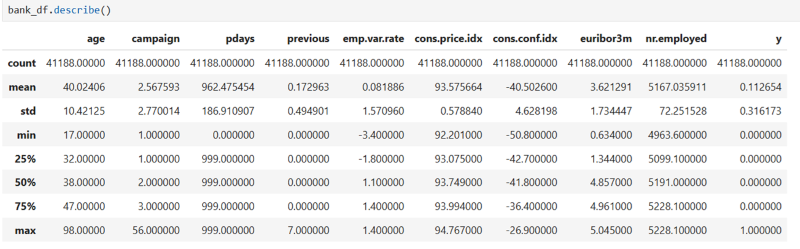

# Term Deposit Customer Classification

## Project Overview

A Portuguese bank has recently run a campaign to attempt to sell a new product to customers over the phone. The product is a term deposit, where customers deposit their money for a fixed period of time for a fixed interest rate. They want to analyze the results of this campaign to understand what makes customers likely to buy this particular product.The CEO has requested the data analytics team to explore the data and use machine learning to build a model to predict whether a customer is likely to buy.

## Table of Contents
1. [Problem Definition](#problem-definition)
2. [Data Collection](#data-collection)
3. [Data Cleaning](#data-cleaning)
4. [Data Exploration](#data-exploration)
5. [Key Features](#key-features)
6. [Modeling](#modeling)
7. [Future Work](#future-work)

## Problem Definition
- Problem Statement
  - Develop predictive model using KNN classification to predict whether a customer will purchase a banking product marketed over the phone.

## Data Collection
- **Dataset Source**:
  - https://archive.ics.uci.edu/ml/datasets/Bank+Marketing

## Data Cleaning
- **Missing Values**: Replaced with '0' for mall within 500km, 1km and 2km and for hawker within 500m, 1km and 2km that have null values
- **Remove data**: Dropped 829 data  for 'mall nearest distance'
- **Duplicates**: No duplicate rows 
- **Data Transformation**: Converted data to the correct format
  
## Data Exploration

- **Exploratory Data Analysis (EDA)**: 

  1. Investigated descriptive statistics about all the numerical columns.

    

    

    
    
    
    
    

    

    
  
    

  
    

    
    
## Key Features
- Town
- Floor Area (sqm) 
- Lease Commence Year 
- Transaction Year 
- Transaction Month 
- Distance to Mall, Hawker & MRT
- Storey Range

## Modeling
- Predictive modeling is built using linear regression, with correlation between key features < ±0.9
- Linear relationship between resale price and different factors .
- For example: 
  - Every km further from MRT would decrease the unit value by $25,000
  - Every sqm increase will have an positive impact of $ 104,000

- Results:

  

  - RMSE: 55,000 (Based on our model, the predicted price can vary from the actual price by $55,000 on average)

  - R2 Score : 0.85 (85% of the changes / variation in the resale prices of HDB houses can be explained by our model)

## Future Work

Future enhancements for this linear regression model include:
- Experimenting with more complex models like Random Forests, Gradient Boosting Machines (GBM), or XGBoost can improve predictive accuracy.
- Incorporating a new feature, 'supermall proximity,' to better capture the influence of nearby shopping malls on HDB resale values.
- Enhancing the Tableau dashboard to improve interactivity, user experience, and data visualization.
- Implementing Auto ARIMA for time-series forecasting to further refine predictions based on market trends and seasonal fluctuations.
