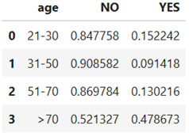

# Term Deposit Customer Classification

## Project Overview

A Portuguese bank has recently run a campaign to attempt to sell a new product to customers over the phone. The product is a term deposit, where customers deposit their money for a fixed period of time for a fixed interest rate. They want to analyze the results of this campaign to understand what makes customers likely to buy this particular product.The CEO has requested the data analytics team to explore the data and use machine learning to build a model to predict whether a customer is likely to buy.

## Table of Contents
1. [Problem Definition](#problem-definition)
2. [Data Collection](#data-collection)
3. [Data Exploration](#data-exploration)
4. [Key Features](#key-features)
5. [Modeling - KNeighborsClassifier](#modeling---kneighborsclassifier)
6. [Conclusions](#conclusions)

## Problem Definition
- Problem Statement
  - Develop predictive model using KNN classification to predict whether a customer will purchase a banking product marketed over the phone.

## Data Collection
- **Dataset Source**:
  - https://archive.ics.uci.edu/ml/datasets/Bank+Marketing

  
## Data Exploration

- **Exploratory Data Analysis (EDA)**: 

  1. Investigated descriptive statistics about all the numerical columns.

      

  2. Identified columns with null values and replaced with ‘Unknown’
     
      

  3. Outliers in age column can be ignored because it is only 1% of the dataset.
    
      
    
      

  4. Explored the relationship between potential features and the target by investigating 3 columns: 
     - Age
     - Job
     - Education 

      These 3 columns have distinct groups that are likely to subscribe (high percentage), so they are good features for machine learning model.

      - Age – People > 70 years old are more likely to subscribe
      
        

      - Job – Students and retirees are more likely to subscribe
      
        

      - Education – Illiterate is more likely to subscribe
      
        

    

## Key Features
Features chosen for each model:
- Model 1 – Age (categorized into 4 groups), job
- Model 2 – Age (categorized into 2 groups), job, education

## Modeling - KNeighborsClassifier

Detail results of both models:
a.	Baseline
Accuracy: 0.8882198698650092

b.	Model 1 – Age, job as features
Accuracy: 0.8891910265125765

  
  

c.	Model 2 – Age, job, education as features
Accuracy: 0.8883169855297659

  

Notes:
-	True Negative (Top-Left Quadrant)
-	False Positive (Top-Right Quadrant)
-	False Negative (Bottom-Left Quadrant)
-	True Positive (Bottom-Right Quadrant)

Results of confusion matrix:
True positive – Model predicted the number of true subscriber
Model 1: 60
Model 2: 28

False negative – Model predicted a person who is a subscriber as a non-subscriber
Model 1: 1091
Model 2: 1123

False positive – Model predicted a person who is a non-subscriber as a subscriber
Model 1: 50
Model 2: 27

## Conclusions

Both models perform better than baseline. However, model 1 has higher accuracy and ‘True Positive’ cases than Model 2. In other words, Model 1 can correctly label a true subscriber to be a subscriber.

Further analysis should be done on ‘False Negative’ cases as this group of customers are subscribers, however, they were predicted wrongly by the model. ‘False positive’ cases can be ignored as these customers are non-subscribers.

